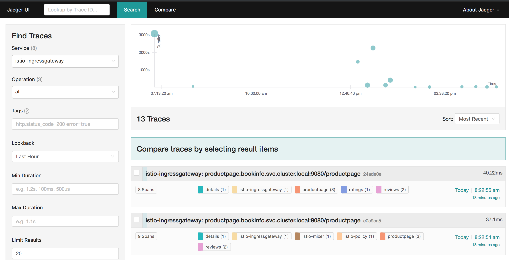
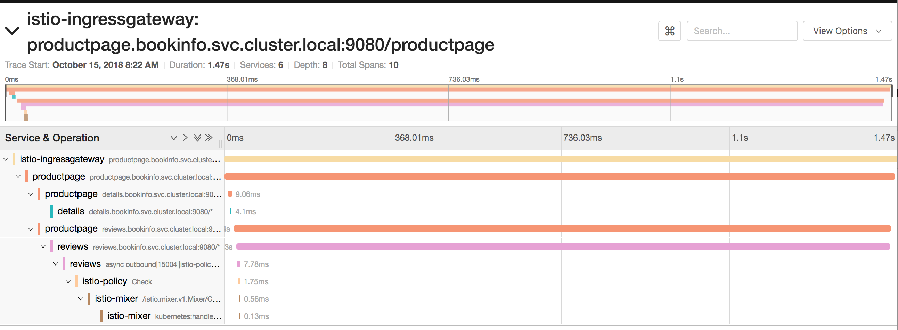

# Deploying sample application

### Prerequisites

* Istio is installed and running 
* Istio samples and tools are also available on your desktop
* Your CLI is changed to the folder where Istio samples are downloaded i.e, when you list the files you should see this

```
$ ls
LICENSE		bin		istio.VERSION	tools
README.md	install		samples
```

### Install Bookinfo sample application

We will deploy the sample bookinfo application explained in the [istiodocs](https://istio.io/docs/guides/bookinfo.html). The instructions are more or less the same as kubernetes with some slight variations. Hence I have documented the openshift deployment process here.

Create a new project for the application

```
$ oc new-project bookinfo
Now using project "bookinfo" on server "https://127.0.0.1:8443".

You can add applications to this project with the 'new-app' command. For example, try:

    oc new-app centos/ruby-22-centos7~https://github.com/openshift/ruby-ex.git

to build a new example application in Ruby.
```

When we install the bookinfo application, the application pods have init containers whose `proxy_init` runs in privileged mode and adds `NET_ADMIN`
as shown here. You will find this in the individual `deployment` artifacts.

```
      initContainers:
      - args:
        - -p
        - "15001"
        - -u
        - "1337"
        - -m
        - REDIRECT
        - -i
        - '*'
        - -x
        - ""
        - -b
        - 9080,
        - -d
        - ""
        image: docker.io/istio/proxy_init:1.0.2
        imagePullPolicy: IfNotPresent
        name: istio-init
        resources: {}
        securityContext:
          capabilities:
            add:
            - NET_ADMIN
          privileged: true
```

These application pods current run as `default` service account in a project. Hence we have to provide `privileged` access to the `default` account. Eventually, these examples should change to not require privileged access. But in the meanwhile, here is how you can set `default` service account to `privileged` security context constraint (scc) in the `bookinfo` project/namespace.

```
oc adm policy add-scc-to-user privileged -z default -n bookinfo
```

Let's now deploy the `bookinfo` application. We are using `istioctl kube-inject` to add `Envoy` sidecar proxies to each of the kubernetes deployment yamls and using the resultant deployment yamls to create an application.

```
kubectl apply -f <(istioctl kube-inject -f samples/bookinfo/platform/kube/bookinfo.yaml)
```
> **Note** you are in the folder where you downloaded Istio samples.

and watch the output as shown below

```
service/details created
deployment.extensions/details-v1 created
service/ratings created
deployment.extensions/ratings-v1 created
service/reviews created
deployment.extensions/reviews-v1 created
deployment.extensions/reviews-v2 created
deployment.extensions/reviews-v3 created
service/productpage created
deployment.extensions/productpage-v1 created
```

Give a few mins for the container images to be pulled and for the pods to come up. Note all the components that are running.

```
$ kubectl get po
NAME                              READY     STATUS            RESTARTS   AGE
details-v1-5c6798dd8d-dbbbj       0/2       PodInitializing   0          33s
productpage-v1-6645b8588d-ztxpb   0/2       PodInitializing   0          29s
ratings-v1-86d8c8dfcb-rqxsx       0/2       PodInitializing   0          33s
reviews-v1-94b6b6b9d-4qhsx        0/2       PodInitializing   0          33s
reviews-v2-5d6498bd56-v5cxv       0/2       PodInitializing   0          32s
reviews-v3-76db6df594-927q6       0/2       PodInitializing   0          31s

$ kubectl get services
NAME          TYPE        CLUSTER-IP       EXTERNAL-IP   PORT(S)    AGE
details       ClusterIP   172.30.4.163     <none>        9080/TCP   30s
productpage   ClusterIP   172.30.247.217   <none>        9080/TCP   28s
ratings       ClusterIP   172.30.119.188   <none>        9080/TCP   30s
reviews       ClusterIP   172.30.142.212   <none>        9080/TCP   29s
```

In order to make your application accessible from outside the cluster, an [Istio Gateway](https://istio.io/docs/concepts/traffic-management/#gateways) is required.

```
$ kubectl apply -f samples/bookinfo/networking/bookinfo-gateway.yaml
gateway.networking.istio.io/bookinfo-gateway created
virtualservice.networking.istio.io/bookinfo created
```
This creates a gateway and a virtual service.

* A [Gateway](https://istio.io/docs/reference/config/istio.networking.v1alpha3/#Gateway) configures a load balancer for HTTP/TCP traffic, most commonly operating at the edge of the mesh to enable ingress traffic for an application.

* A [VirtualService](https://istio.io/docs/reference/config/istio.networking.v1alpha3/#VirtualService) defines the rules that control how requests for a service are routed within an Istio service mesh

The gateway will direct all the `HTTP` traffic coming on port `80` at istio-ingressgateway to the bookinfo sample application

```
$ kubectl get gateway
NAME               CREATED AT
bookinfo-gateway   11s

$ kubectl get gateway bookinfo-gateway -o yaml
apiVersion: networking.istio.io/v1alpha3
kind: Gateway
metadata:
  annotations:
    kubectl.kubernetes.io/last-applied-configuration: |
      {"apiVersion":"networking.istio.io/v1alpha3","kind":"Gateway","metadata":{"annotations":{},"name":"bookinfo-gateway","namespace":"bookinfo"},"spec":{"selector":{"istio":"ingressgateway"},"servers":[{"hosts":["*"],"port":{"name":"http","number":80,"protocol":"HTTP"}}]}}
  clusterName: ""
  creationTimestamp: 2018-10-10T16:46:45Z
  generation: 1
  name: bookinfo-gateway
  namespace: bookinfo
  resourceVersion: "16011"
  selfLink: /apis/networking.istio.io/v1alpha3/namespaces/bookinfo/gateways/bookinfo-gateway
  uid: 12d4fddb-ccac-11e8-b16d-66d8cef31907
spec:
  selector:
    istio: ingressgateway
  servers:
  - hosts:
    - '*'
    port:
      name: http
      number: 80
      protocol: HTTP
```

And the virtualservice would match the traffic at specific endpoints `/productpage`, ` /login`, `/logout` etc.

```
$ kubectl get virtualservice
NAME       CREATED AT
bookinfo   6h

$ kubectl get virtualservice bookinfo -o yaml
apiVersion: networking.istio.io/v1alpha3
kind: VirtualService
metadata:
  annotations:
    kubectl.kubernetes.io/last-applied-configuration: |
      {"apiVersion":"networking.istio.io/v1alpha3","kind":"VirtualService","metadata":{"annotations":{},"name":"bookinfo","namespace":"bookinfo"},"spec":{"gateways":["bookinfo-gateway"],"hosts":["*"],"http":[{"match":[{"uri":{"exact":"/productpage"}},{"uri":{"exact":"/login"}},{"uri":{"exact":"/logout"}},{"uri":{"prefix":"/api/v1/products"}}],"route":[{"destination":{"host":"productpage","port":{"number":9080}}}]}]}}
  clusterName: ""
  creationTimestamp: 2018-10-10T16:46:45Z
  generation: 1
  name: bookinfo
  namespace: bookinfo
  resourceVersion: "16012"
  selfLink: /apis/networking.istio.io/v1alpha3/namespaces/bookinfo/virtualservices/bookinfo
  uid: 12e74346-ccac-11e8-b16d-66d8cef31907
spec:
  gateways:
  - bookinfo-gateway
  hosts:
  - '*'
  http:
  - match:
    - uri:
        exact: /productpage
    - uri:
        exact: /login
    - uri:
        exact: /logout
    - uri:
        prefix: /api/v1/products
    route:
    - destination:
        host: productpage
        port:
          number: 9080
      
 
```


The virtual service above shows that we can access product page at `/productpage` endpoint. This endpoint is for the Istio ingress i.e.,

```
$ kubectl get route -n istio-system istio-ingressgateway
NAME                   HOST/PORT                                                PATH      SERVICES               PORT      TERMINATION   WILDCARD
istio-ingressgateway   istio-ingressgateway-istio-system.192.168.64.72.nip.io             istio-ingressgateway   http2                   None
```

> **Note** Your URLs would be different from mine. So use your values. If you want  to know your URLs run `kubectl get route -n istio-system`

Save this URL as an environment variable

```
export URL=$(kubectl get route istio-ingressgateway -n istio-system -o yaml -o jsonpath={.spec.host})
```
So I can access the product page at the URL [http://${URL}/productpage](http://${URL}/productpage). 

Familiarize with this application a little bit. Use it a few times. 

### Service Graph

Check the service graph on kiali at [https://kiali-istio-system.192.168.64.72.nip.io](https://kiali-istio-system.192.168.64.72.nip.io)
You can use the `Graph` menu item on the left of Kiala to view this graph as below: *Use your own URL*


Right next to the service graph, you will see a summary of the traffic success and error rates which gives you a snapshot of the health of your microservices running on the platform

### Application Metrics

Click on the `Applications` menu to get an application centric view of different microservices, their health/error rate and their inbound and outbound metrics such as `Request Volume`, `Request Duration`, `Request Size`, `Response Size` etc.
These are helpful for debugging your microservices as you use them further.

You'll get similar information using `Workloads` menu item, where the viewpoint is based on kubernetes deployments rather than applications.

Yet another view is provided based on Kubernetes Services with the `Services` menu item.

### Tracing

Click on `Distributed Tracing	` on the Kiali menu to connect to Jaeger. 

> **Note** If you are not getting redirected to Jaeger, you may have to enable popups from Kiali page

Jaeger provides tracing info for all the calls you made. Select a service on the left hand menu such as `istio-ingressgateway` or `productpage` and you will see the list of traces for all your usage.



You can compare these traces by selecting a few of them, or you can select a particular trace by clicking on one of them and look at the response times as shown below.




### Monitoring

Also notice the data collected by Prometheus and displayed on Grafana at [http://grafana-istio-system.192.168.64.72.nip.io/d/LJ_uJAvmk/istio-service-dashboard](http://grafana-istio-system.192.168.64.72.nip.io/d/LJ_uJAvmk/istio-service-dashboard) *Use your own URL*


### Destination Rules

We have the Bookinfo application running now. Let's apply some destination rules  from the file `samples/bookinfo/networking/destination-rule-all-mtls.yaml` that will allow us to shape traffic according to the subsets we define in these rules. 

A [DestinationRule](https://istio.io/docs/reference/config/istio.networking.v1alpha3/#DestinationRule) configures the set of policies to be applied to a request after VirtualService routing has occurred.

Let us first look at these destination rules. These are four rules applies to **productpage**, **reviews**, **ratings** and **details**. The rules define subsets based on the *version* labels. These subsets will be used in the future labs for traffic shaping. 

```
$ cat samples/bookinfo/networking/destination-rule-all-mtls.yaml
apiVersion: networking.istio.io/v1alpha3
kind: DestinationRule
metadata:
  name: productpage
spec:
  host: productpage
  trafficPolicy:
    tls:
      mode: ISTIO_MUTUAL
  subsets:
  - name: v1
    labels:
      version: v1
---
apiVersion: networking.istio.io/v1alpha3
kind: DestinationRule
metadata:
  name: reviews
spec:
  host: reviews
  trafficPolicy:
    tls:
      mode: ISTIO_MUTUAL
  subsets:
  - name: v1
    labels:
      version: v1
  - name: v2
    labels:
      version: v2
  - name: v3
    labels:
      version: v3
---
apiVersion: networking.istio.io/v1alpha3
kind: DestinationRule
metadata:
  name: ratings
spec:
  host: ratings
  trafficPolicy:
    tls:
      mode: ISTIO_MUTUAL
  subsets:
  - name: v1
    labels:
      version: v1
  - name: v2
    labels:
      version: v2
  - name: v2-mysql
    labels:
      version: v2-mysql
  - name: v2-mysql-vm
    labels:
      version: v2-mysql-vm
---
apiVersion: networking.istio.io/v1alpha3
kind: DestinationRule
metadata:
  name: details
spec:
  host: details
  trafficPolicy:
    tls:
      mode: ISTIO_MUTUAL
  subsets:
  - name: v1
    labels:
      version: v1
  - name: v2
    labels:
      version: v2
---

```

Let us now apply these labels by running

```
kubectl apply -f samples/bookinfo/networking/destination-rule-all-mtls.yaml
```

Get back to Kiala menu option `Istio Config` on the left to find these destination rules. **Istio Config** can be used to view all the rules applied on the traffic at any point of time.


### Clean Up

> **Note** If you are proceeding with other labs, you don't run clean up. Just move ahead with the next lab.

In order to remove the BookInfo application deployed so far, run the following commands.

```
samples/bookinfo/platform/kube/cleanup.sh
```

or you can clean up the objects individually by running the following

```
kubectl -n bookinfo delete virtualservices --all 	# deletes all virtual services
kubectl -n bookinfo delete destinationrules --all 	# delete all destination rules
kubectl -n bookinfo delete gateway --all 	# deletes all gateways
kubectl -n bookinfo delete -f samples/bookinfo/platform/kube/bookinfo.yaml 	# deletes all services and deployments
kubectl -n bookinfo delete rs --all 			# deletes all replica sets
kubectl -n bookinfo delete pods --all 		# deletes all pods
```


### Summary

In this chapter

* We have deployed our sample Bookinfo application and tested it
* Created a gateway to reach the application
* Added destination rules to set up routing rules later
* We also looked at how to monitor and trace this application using Istio's supported services


